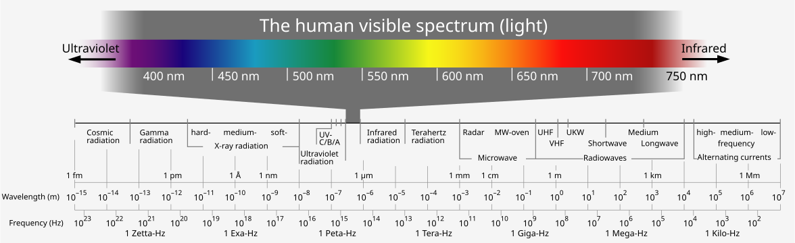
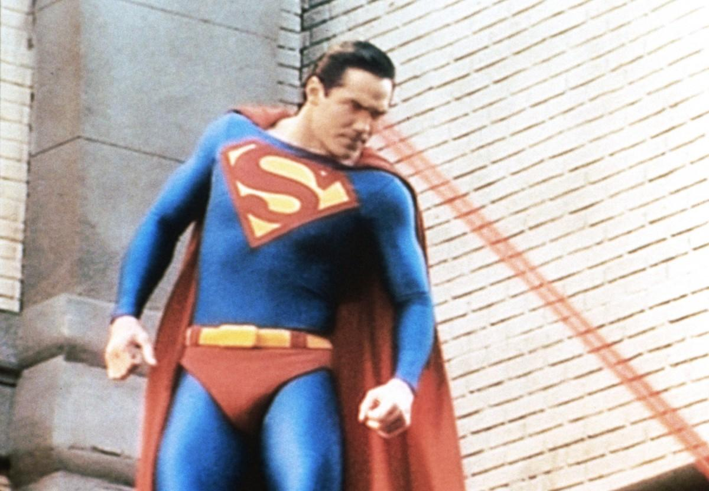
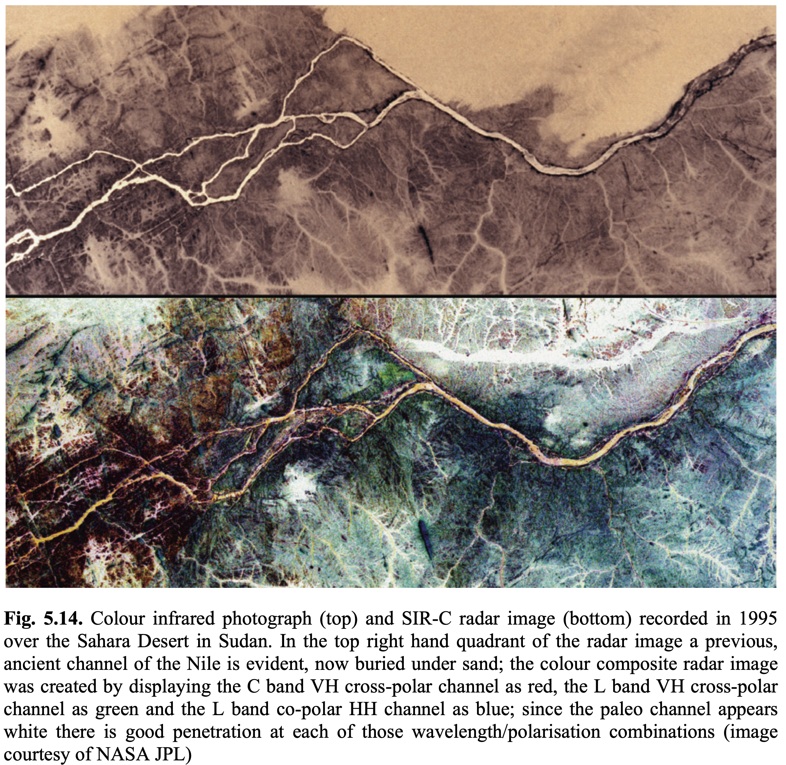
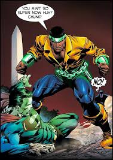
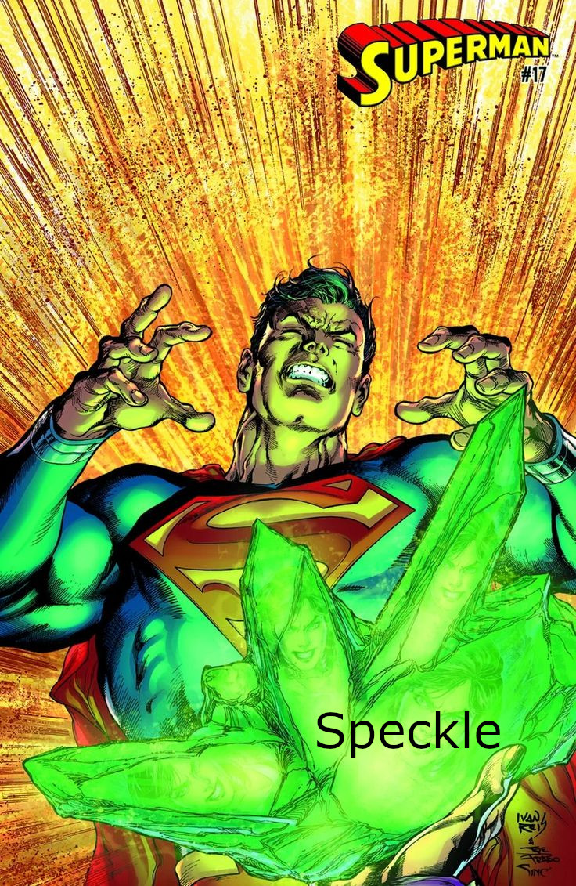
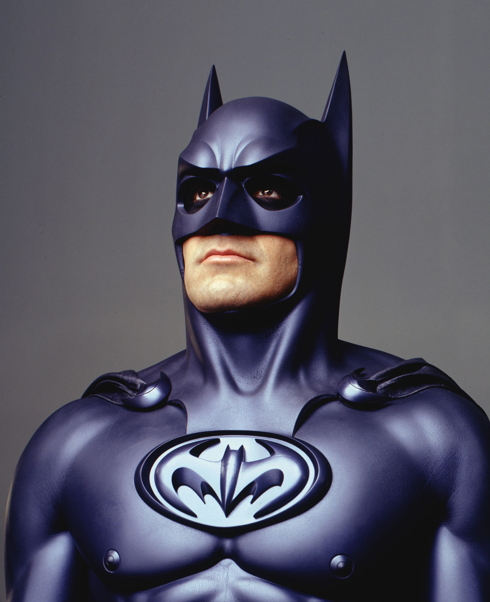
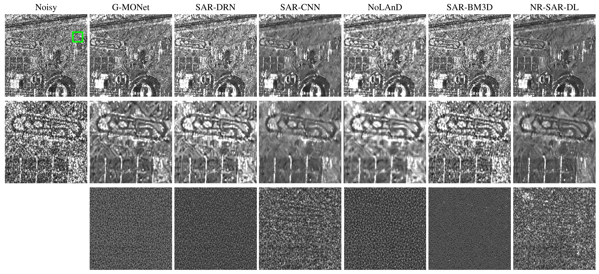

```{r setup, echo=FALSE}         
library(ggplot2)
library(ggthemes)
  theme_set(theme_tufte() +
  theme(text=element_text(size=20, family="serif")))
library(caret)
library(patchwork)
library(scales)

set.seed(123456789, kind="Mersenne-Twister")

fGammaSAR <- function(z, mu, L){
  return(
    (L^L / (gamma(L)*mu^L)) *
      z^{L-1} *
      exp(-L*z/mu)
  )
}

fGI0SAR <- function(z, mu, alpha, L){
  return(
    (L^L*gamma(L-alpha) /
       ((-mu*(alpha+1))^alpha *
          gamma(-alpha) * gamma(L))) *
      z^(L-1) /
      (-mu*(alpha+1)+L*z)^(L-alpha)
  )
}
```

# Introduction

## What do we mean when we talk about “active microwave imaging”?

We are used to seeing reality through the **visible** portion of the **electromagnetic spectrum**.

{alt="Electromagnetic spectrum"}

The information contained in these frequencies cannot penetrate clouds, haze, rain, tree canopies, walls...

## What do we mean when we talk about “active microwave imaging”?

::: columns

::: column

{alt=""}

:::

::: column
We can do better, much better. Our superpower is called
Synthetic Aperture Radar (SAR).

- Sensors mounted on satellites, aircrafts, and mobile platforms

- They emit and capture radiation in the microwave spectrum.

- They operate day and night and are not affected by adverse atmospheric conditions.

- They can **penetrate**

  - clouds, haze, rain,

  - tree canopies,

  - ground cover.

:::

:::

# Applications of SAR Images

## 

{width="60%"}

## 

{width="100%"}

## 

{width="100%"}

In this example, we see the price paid for using SAR images (as well as laser, ultrasound-B, and sonar imagery): *speckle* noise.

- it is an inherent phenomenon in coherent imaging,

- it makes human interpretation and automatic image processing difficult,

- classical techniques (mean filter, etc.) are not effective.

# Limitations of the Superpower

## Speckle

::: columns

::: {.column .fragment}
Without help, our superpower is of limited use.

{width="70%"}
:::

::: column
{width="80%"}
:::

:::

## Statistics comes to save us

::: columns

::: {.column width="60%"}
Speckle can be modeled statistically.

A careful **physical** formulation leads to

- probability distributions that are not Gaussian,

- contamination that is not additive.

These challenges have been successfully addressed by the community, resulting in

- classification techniques,

- speckle reduction filters,

- interpretation pipelines.
:::

::: {.column width="40%"}

:::

:::

## Do we really need all this work?

Why not just feed the images into DeepSeek?

- LLMs cannot handle speckle *per se*.
- LLM-based filters and classifiers perform very poorly on SAR images.
- LLMs do not know how to interpret SAR images.
- But we are going to teach them!

# First solution: training with “raw” data

## Teaching Deep Learning models

- “Teaching” neural networks consists of showing **many** labeled examples.

- Labeling SAR images is very expensive because

  - speckle makes everything complicated;

  - the images can be very large (high spatial resolution);

  - they are captured very frequently (high temporal resolution);

  - there is no single definitive algorithm for labeling SAR images.

## ... but we have excellent statistical models

::: {.columns}

::: {.column width="60%"}
We can generate fast simulations that are as realistic as necessary.

The computational cost of generating these simulations is extremely low.

We have complete control over the output.

On the right we see samples of sand, pasture, and forest.

:::

::: {.column width="40%"}
{style="height: 50vh; width: auto; object-fit: contain;"}

:::

:::

## Speckle reduction filters

@SARDespecklingUsingMultiObjectiveNeuralNetworkTrainedwithGenericStatisticalSamples trained
a neural network to reduce speckle using simulated samples.

{style="height: 60vh; width: auto; object-fit: contain;"}

# Second solution: “digesting” the raw data for the network

## From numbers to explanations

::: {.incremental}

- We formulate a statistical model in which the observations (numbers) are events of a random variable $Z$.

- The distribution of $Z$ has three parameters, and one of them “counts” how many objects there are in each pixel, on average.

- We collect a few observations and estimate this parameter using an efficient method resistant to contamination.

- We map these estimates, pixel by pixel, into a color map.

- This map can be used as a layer of **explainable** (interpretable) information for Machine Learning-based systems.\
:::

## San Francisco

```{r SanFrancisco}       
#| echo: false
#| results: asis

cat('
<div style="display: flex; justify-content: center; gap: 1em;">
  
  
</div>
')
```

## Munich

```{r Munich}         
#| echo: false
#| results: asis

cat('
<div style="display: flex; justify-content: center; gap: 1em;">
  
  
</div>
')
```

## Port of Dublin

```{r Dublin}         
#| echo: false
#| results: asis

cat('
<div style="display: flex; justify-content: center; gap: 1em;">
  
  
</div>
')
```

## Foggia

```{r Foggia}         
#| echo: false
#| results: asis

cat('
<div style="display: flex; justify-content: center; gap: 1em;">
  
  
</div>
')
```

# *The End*

## Key takeaways

::: {.incremental}

- Although we have discussed SAR images, speckle also appears in other modalities, for example in the laser inspection of fruits, vegetables, eggs, and meat.

- The methodology (**understand**, **model**, **train**, **extract**) can (*should?*) be applied to adapt LLMs to specific problems.

- An interdisciplinary approach is required.

- Investments in this area produce immediate returns.
:::

## Contact {.fullpage}

::: columns
::: {.column width="45%"}

<div style="text-align:center;">

{width="50%"}

{width="50%"}

</div>

:::

::: {.column width="55%"}
Alejandro C. Frery\
School of Mathematics and Statistics\
Victoria University of Wellington\
New Zealand\
\
alejandro.frery at vuw.ac.nz
:::
:::

## References {.references-slide}
