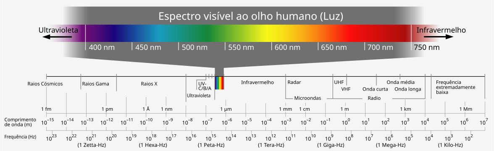
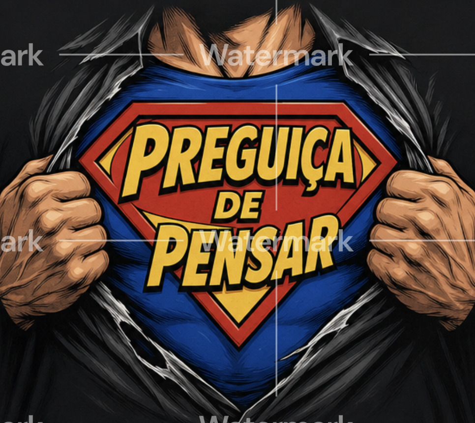

```{r setup}
library(ggplot2)
library(ggthemes)
  theme_set(theme_tufte() +
  theme(text=element_text(size=20, family="serif")))
library(caret)
library(patchwork)
library(scales)

set.seed(123456789, kind="Mersenne-Twister")

fGammaSAR <- function(z, mu, L){
  return(
    (L^L / (gamma(L)*mu^L)) *
      z^{L-1} *
      exp(-L*z/mu)
  )
}

fGI0SAR <- function(z, mu, alpha, L){
  return(
    (L^L*gamma(L-alpha) / 
       ((-mu*(alpha+1))^alpha *
          gamma(-alpha) * gamma(L))) *
      z^(L-1) /
      (-mu*(alpha+1)+L*z)^(L-alpha)
  )
}
```

# Introdução

## Do que falamos quando falamos de "imagens complexas"?

Estamos acostumados a enxergar a realidade na porção **visível** do **espectro eletromagnético**.



A informação contida nessas frequências não atravessa nuvens, bruma, chuva, as copas das árvores, paredes... 

## Do que falamos quando falamos de "imagens complexas"?

::: columns

::: column


:::

::: column
Podemos fazer melhor, bem melhor. O nosso superpoder se chama
Radar de Abertura Sintética (SAR -- *Synthetic Aperture Radar*).

* São sensores montados em satélites, aviões, e qualquer plataforma móvil
* Emitem e captam radiação no espectro das microondas.
* Operam dia e noite, não são afetados por condições atmosféricas adversas.
* Podem **atravessar**
   * nuvens, bruma, chuva,
   * copas das árvores,
   * cobertura do solo.
:::

:::

# Aplicações de Imagens SAR

## 

{width="60%"}

##

{width="100%"}

##

{width="100%"}

Vemos, neste exemplo, o preço que se paga por usar imagens SAR (de laser, ultrassom-B, sonar): o ruído *speckle*:

* é un fenômeno inerente ao imageamento com radiação coerente,
* dificulta a interpretação humana e o processamento automático das imagens,
* as técnicas clássicas (filtro da média, etc.) não são eficazes.

# Limitações do Superpoder

## Speckle

::: columns

::: {.column .fragment}
Sem ajuda, o nosso superpoder é pouco útil.

{width="70%"}
::: 

::: column
{width="80%"}
:::

:::

## A estatística vem para nos salvar

::: columns

::: {.column width="60%"}
O speckle pode ser modelado estatisticamente. 

Uma formulação **física** cuidadosa leva a 

* distribuições de probabilidade que não são a normal, 
* contaminação que não é aditiva.

Esses são desafios enfrentados com sucesso pela comunidade, resultando em

* técnicas de classificação,
* filtros redutores de speckle,
* *pipelines* de interpretação.
:::

::: {.column width="40%"}

:::

:::

## Será que precisamos desse trabalho todo?

::: columns

::: {.column width="60%"}

Por que não jogar as imagens no ChatGPT?



:::

::: {.column width="40%"}

* LLMs não *aguentam* o speckle.
* Filtros e classificadores baseados em LLMs são muito ruins para imagens SAR.
* LLMs não sabem interpretar imagens SAR.
* Mas nós vamos ensiná-los!

:::

::: 

# Primeira solução: treinamento com dados "brutos"

## Ensinar a Modelos baseados em *Deep Learning*

* "Ensinar" redes neurais consiste em mostrar **muitos** exemplos rotulados
* Rotular imagens SAR é muito caro porque
   * o speckle torna tudo complicado;
   * as imagens podem ser muito grandes (alta resolução espacial);
   * são capturadas com muita frequência (alta resolução temporal);
   * não há **um** algoritmo definitivo para rotular imagens SAR.
   
## ... mas temos excelentes modelos estatísticos

::: {.columns}

::: {.column width="60%"}
Podemos fazer simulações rápidas e tão realistas quanto necessário.

O custo computacional para gerar essas simulações é baixíssimo.

O controle que temos sobre o resultado é total.

À direita vemos amostras de areia, pasto e floresta.

:::

::: {.column width="40%"}
{style="height: 60vh; width: auto; object-fit: contain;"}

[*FONTE: @SimulationSpatiallyCorrelatedClutter2009 *]{.small}
:::

::: 

## Filtros de redução de speckle

@SARDespecklingUsingMultiObjectiveNeuralNetworkTrainedwithGenericStatisticalSamples treinaram
uma rede neural para reduzir speckle usando amostras simuladas.

{style="height: 60vh; width: auto; object-fit: contain;"}

# Segunda solução: "digerir" os dados brutos para a rede

## De números para explicações

::: {.incremental}
* Formulamos um modelo estatístico em que as observações (números) são eventos de uma variável aleatória $Z$.
* A distribuição de $Z$ tem três parâmetros, e um deles "conta" quantos objetos há em cada pixel, em média.
* Coletamos umas poucas observações, e estimamos esse parâmetro com um método próprio eficiente e resistente a contaminações.
* Mapeamos essas estimativas, pixel a pixel, em um mapa de cores.
* Esse mapa pode ser usado como uma camada de informações **explicáveis** (interpretáveis) para sistemas baseados em Aprendizagem de Máquina.
:::

## San Francisco

```{r SanFrancisco, out.width="100%"}
#| echo: false
#| results: asis

cat('
<div style="display: flex; justify-content: center; gap: 1em;">
  
  
</div>
')
```

## Munique

```{r}
#| echo: false
#| results: asis

cat('
<div style="display: flex; justify-content: center; gap: 1em;">
  
  
</div>
')
```

## Porto de Dublin

```{r}
#| echo: false
#| results: asis

cat('
<div style="display: flex; justify-content: center; gap: 1em;">
  
  
</div>
')
```

## Foggia

```{r}
#| echo: false
#| results: asis

cat('
<div style="display: flex; justify-content: center; gap: 1em;">
  
  
</div>
')
```

# *The End*

## Para lembrar

::: {.incremental}
* Embora tenhamos falado de imagens SAR, o speckle aparece em outras modalidades, por exemplo, em inspecção de frutas, legumes, ovos, e carnes por laser.
* A metodologia (entender, modelar, treinar, extrair) pode (*deve?*) ser aplicada para adaptar LLMs ao problema específico.
* É necessária uma abordagem interdisciplinar.
* Investimentos nessa frente têm retornos imediatos.
:::

## Contact {.fullpage}

::: columns
::: {.column width="45%"}
{out-width="40%"}
:::

::: {.column width="55%"}
  Alejandro C. Frery\
School of Mathematics and Statistics\
Victoria University of Wellington\
New Zealand\
  \
alejandro.frery at vuw.ac.nz\
:::
:::

## References  {.references-slide}
