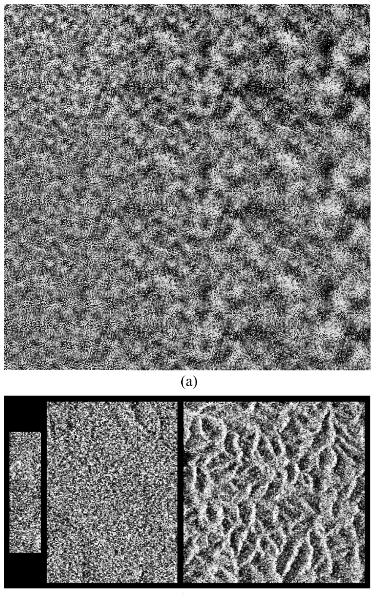
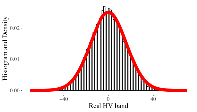
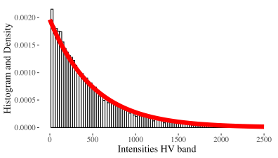
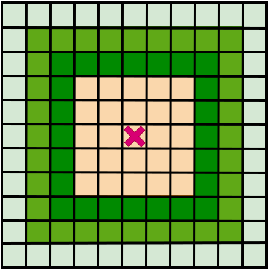
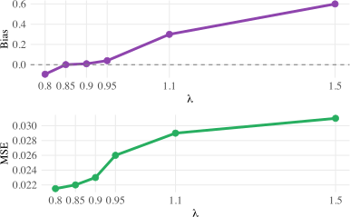

```{r setup}
library(ggplot2)
library(ggthemes)
  theme_set(theme_tufte() +
  theme(text=element_text(size=20, family="serif")))
library(caret)
library(patchwork)
library(scales)

set.seed(123456789, kind="Mersenne-Twister")
```

# Introduction 

:::: {.columns}

::: {.column width="80%"}
* Several imaging modalities employ coherent imaging, e.g.,

   * Laser (does a laser pointer produce a flat light spot?)
   * Ultrasound-B
   * Sonar
 * Synthetic Aperture Radar (SAR)
   
* When a surface is illuminated with coherent light, the resulting image 
is degraded by a high-contrast granular interference pattern: [speckle]{.alert-info}.

* Speckle arises from the interference of scattered wave fronts.
:::

::: {.column width="20%"}
{style="height: 60vh; width: auto; object-fit: contain;"}

[*Simulated and actual speckle. FROM: @SimulationSpatiallyCorrelatedClutter2009 *]{.small}
:::

::::

## 

The complex observation $S$ is the summation of complex quantities.

```{r ComplexReturn}
N <- 15 # number of scatterers
sigma2 <- 1
RAi <- c(rnorm(n = N, mean = 0, sd = sqrt(sigma2)))
IAi <- c(rnorm(n = N, mean = 0, sd = sqrt(sigma2)))

DATA <- data.frame(RAi, IAi)

ggplot(data=DATA) +
  geom_segment(aes(x=c(0, cumsum(RAi)[1:(N-1)]), # All vectors
                   y=c(0, cumsum(IAi)[1:(N-1)]), 
                   xend=cumsum(RAi), yend=cumsum(IAi)), 
               arrow=arrow(ends="last", 
                           type = "closed", 
                           angle = 15, 
                           length = unit(.3, units="cm")), 
               linewidth=.3, color="black") +
  geom_segment(aes(x=0, y=0, xend=sum(RAi), yend=sum(IAi)), # Sum of the vectors
               arrow=arrow(ends="last", 
                           type = "closed", 
                           angle = 15, 
                           length = unit(.4, units="cm")), 
               linewidth=1.2,
               col="maroon") +
  geom_segment(aes(x=RAi[1], xend=RAi[1], y=0, yend=IAi[1]), linewidth=.2, linetype="dashed") +
  geom_segment(aes(x=0, xend=RAi[1], y=IAi[1], yend=IAi[1]), linewidth=.2, linetype="dashed") +
  annotate("text", label="Re(italic(S)[1])", parse=TRUE, x=RAi[1], y=0, vjust=0, size=5, family="serif") +
  annotate("text", label="Im(italic(S)[1])", parse=TRUE, x=0, y=IAi[1], hjust=1, size=5, family="serif") +
  annotate("text", label="italic(S)[1]", parse=TRUE, x=RAi[1], y=IAi[1], hjust=0, size=5, family="serif") +
  annotate("text", label="italic(S)", parse=TRUE, x=sum(RAi)-.05, y=sum(IAi), hjust=1, size=7, family="serif") +
  geom_hline(yintercept=0, col="grey32") +
  geom_vline(xintercept=0, col="grey32") +
  coord_fixed() +
  xlab("Real components") + ylab("Imaginary components") 
```

## The fully-developed speckle model

The observation in a pixel is
$$
S = \sum_{\ell=1}^m S_\ell e^{j \phi_\ell} = \underbrace{\sum_{\ell=1}^m |S_\ell| \cos \phi_\ell}_{\Re(S)} +
j \underbrace{\sum_{\ell=1}^m |S_\ell| \sin \phi_\ell}_{\Im(S)}.
$$
We model $S_\ell\colon\Omega\rightarrow\mathbb C$ and $\phi_\ell\colon\Omega\rightarrow(0,2\pi]$ as random variables.
If

* $m\to\infty$ (infinitely many scatterers in the resolution cell),
<!-- * $\max\operatorname{Var}(S_\ell)<\infty$ (no scatterer dominates), -->
* $|S_\ell| \perp |S_k|$ (independent amplitudes) with $\max\operatorname{Var}(S_\ell)<\infty$ (no scatterer dominates)
* $\phi_\ell \perp \phi_k\sim\mathcal U(-\pi,\pi]$ (iid uninformative phases),
* the amplitudes are collectively independent of the phases,

then we can invoke the Central Limit Theorem
and say that $\Re(S)$ and $\Im(S)$ are asymptotically iid zero-mean normal independent.

## Do we observe fully-developed speckle in practice?

::: columns

::: column
* Typical spatial resolutions are of the order of ${10}\times{10}\,\text{m}^2$.
* The number of backscatterers $m$ is the number of elements in the resolution cell of the order of the wavelength
   * X-band: $\approx 3\text{ cm}$
   * L-band: $\approx 20\text{ cm}$
* Pasture, crops, and bare soil usually verify $m\to\infty$ and the other hypotheses.
:::

::: column
```{r}
#| echo: false
#| fig-align: center
#| fig-width: 10
#| fig-height: 10
#| out-width: "100%"

knitr::include_graphics("../Figures/foggia-italy_1900.png")
```
:::

:::


## Do we observe fully-developed speckle in practice?

We took a sample of $15561$ observations over crops.

::: columns
::: column
{width="100%"}
:::
::: column
{width="100%"}
:::
:::

## Multilook imaging

* Exponentially distributed observations are very noisy.
* We average $L$ (ideally independent) pixels, and obtain a multilook image with (ideally) $L$ looks.
* Under the assumptions of fully-developed speckle,
$$
Z=|S|^2 \sim \Gamma_{\text{SAR}}(\mu, L),
$$
a Gamma distribution conveniently parametrised by the mean $\mu>0$ and
the shape $L\geq 1$:
$$
\color{DarkOrchid}{f_{\Gamma_{\mathrm{SAR}}}\bigl(z;\mu, L\bigr) 
    = \frac{L^L}{\Gamma(L)\,\mu^L} z^{L-1} 
    \exp \biggl(-\frac{Lz}{\mu}\biggr)
    \mathbb I_{\mathbb R_+}(z)}. 
$$
* If $L=1$, we fall back to the exponential model.

## What happens if the speckle is not fully-developed? 

::: columns

::: column
```{r}
#| echo: false
#| fig-align: center
#| fig-width: 10
#| fig-height: 10
#| out-width: "100%"

knitr::include_graphics("../Figures/dubli_1600.png")
```
:::

::: column
* This may occur when at least one of the hypotheses is violated.
* Typically, when $m$ is finite, i.e., the number of elementary backscatterers in the resolution cell is not big:
   * a few in forested regions,
   * even less in urban areas.
* When the backscatter changes among resolution cells.
* [The $\Gamma_{\text{SAR}}$ model fails to describe the extreme variability.]{.alert-warning}
:::

:::

## Non fully-developed speckle

The $\mathcal G^0_{\text{SAR}}$ model generalises the $\Gamma_{\text{SAR}}$
distribution and incorporates $\alpha<0$, such that $|\alpha|\propto m$, the number of backscatterers:
\begin{multline}
\color{DarkOrchid}{f_{\mathcal{G}^0_{\text{SAR}}}\bigl(z; \mu, \alpha, L \bigr)}
    = \\ \color{DarkOrchid}{\frac{L^L\,\Gamma(L-\alpha)}
    {\bigl[-\mu(\alpha+1)\bigr]^{\alpha} \Gamma(-\alpha)\,\Gamma(L)}
    \frac{z^{L-1}}
    {\bigl[-\mu(\alpha+1)+Lz\bigr]^{L-\alpha}}
    \mathbb I_{\mathbb R_+}(z)},
\end{multline}
where $\mu > 0$ is the mean intensity.

This model can describe data with extreme variability ($\alpha\approx0$) and fully-developed speckle ($\alpha\to-\infty$).

## Recap

We have two models to describe the observations:

* The $\Gamma_{\text{SAR}}(\mu,L)$ model for fully-developed speckle, and
* The more general $\mathcal G^0_{\text{SAR}}(\mu,\alpha,L)$ law that includes the fully-developed speckle situation.

[We want to measure how close (or far) we are from the fully-developed speckle model, but using small samples possibly contaminated by outliers.]{.alert-warning}

How can we do it?

## What is Entropy?

:::: {.columns}

::: {.column width="35%"}
```{r}
#| echo: false
#| fig-align: center
#| fig-width: 10
#| fig-height: 10
#| out-width: "100%"
knitr::include_graphics("../Figures/entropy.jpg")
```
:::

::: {.column width="65%"}
Citing @EntropyAMeasureofJustHowLittleWeReallyKnow:

* Life is an anthology of destruction. 
* Everything you build eventually breaks.
* Everyone you love will die. 
* The entire universe follows a dismal trek toward a dull state of ultimate turmoil.
* [Entropy is always on the rise]{.alert-info} is among nature's most inescapable commandments.
* [Entropy is a measure of disorderliness.]{.alert-danger}
:::

::::

## Flavours of Entropy

For a continuous random variable with distribution $\mathcal D$ characterised by a probability density function $f$, we have (among infinitely many others):

* Shannon entropy: 
$$
H^{\text{S}}(\mathcal D)  = - \int  f \ln f.
$$
* Rényi entropy $$
H^{\text{R}}_\lambda(\mathcal D)  = \frac{1}{\lambda-1} \ln \bigg( \int f^\lambda\bigg),
\text{ with } \lambda\in\mathbb R_+\setminus\{1\}.
$$
* Tsallis entropy
$$
H^{\text{T}}_\lambda(\mathcal D) = \color{DarkOrchid}{T_\lambda(\mathcal D)  = \frac{1}{\lambda-1}\bigg(1-\int f^\lambda\bigg)},
\text{ with } \lambda\in\mathbb R_+\setminus\{1\}.
$$

The parameter $\lambda$ calibrates the sensitivity of $T_\lambda$ to
small probability values.

##

We make a transformation:
$$
T_\lambda(\mathcal D) =
\frac{1}{1-\lambda}\biggl(1-
\int_{-\infty}^{\infty} f^\lambda(x) dx \biggr)  = \frac{1}{\lambda-1}
     \left(
       1-\int_{0}^{1}\bigl(Q'(p)\bigr)^{1-\lambda} dp
     \right),
$$
and "approximate" the quantile function $Q(p)$ by order statistics,
and its derivative $Q'(p)$ by their differences (spacings).
Let $\mathbf{Z}=(Z_1,Z_2,\dots,Z_n)$ be an i.i.d.\ sample from $F$, with order statistics $Z_{(1)}\le Z_{(2)} \le \cdots\le Z_{(n)}$.
Our estimator is
$$
  \widehat T_{\lambda}(\mathbf{Z})
  = \frac{1}{\lambda-1}
  \left\{
    1-\frac{1}{n}
       \sum_{i=1}^{n}
       \left(
         \frac{Z_{(i+k)}-Z_{(i-k)}}{(k/n) \, c_i}
       \right)^{1-\lambda}
  \right\},
  \label{eq:Tsallis-spacing-estimator}
$$

where
[$$
c_i=
\begin{cases}
\dfrac{k+i-1}{k} & \text{if } \; 1\le i\le k,\\
2 & \text{if } \; k+1\le i\le n-k,\\
\dfrac{n+k-i}{k} & \text{if } \; n-k+1\le i\le n.
\end{cases}
$$]{.small}
We use the heuristic spacing $k=\lfloor\sqrt{n}+0.5\rfloor$.

## Noteworthy facts

Our [model-free]{.alert-info} estimator of $T_\lambda(\mathcal D)$
$$
\color{DarkOrchid}{\widehat T_{\lambda}(\mathbf{Z})
  = \frac{1}{\lambda-1}
  \left\{
    1-\frac{1}{n}
       \sum_{i=1}^{n}
       \left(
         \frac{Z_{(i+k)}-Z_{(i-k)}}{(k/n) \, c_i}
       \right)^{1-\lambda}
  \right\}}
$$

* estimates the Tsallis entropy regardless the model,
* converges to the Shannon entropy when $\lambda\rightarrow1$,
* requires sorting the typically small vector $\mathbf z = \mathbf Z(\omega)$ and simple operations,
* does not suffer from numerical instabilities,
* is asymptotically consistent and normal.

# Methodology

## Goodness-of-fit test 

Given a random sample $\mathbf Z = (Z_1,Z_2,\dots,Z_n)$, our problem can be stated as a goodness-of-fit test:
\begin{align}
\mathcal H_0 &: \mathbf Z \text{ is compatible with } \Gamma_{\text{SAR}}(\mu,L),\\
\mathcal H_1 &:  \mathbf Z \text{ is compatible with } \mathcal G^0_{\text{SAR}}(\mu,\alpha,L).
\end{align}

It is a nested-distribution problem.
There are plenty of tests for problems like this.
We build a test statistic based on $\widehat T_{\lambda}(\mathbf{Z})$, and make it

* perform well with relatively small samples,
* resist outliers, and
* computationally efficient.

Our test statistic is based on $\widehat T_{\lambda}(\mathbf{Z})$ because
$$
\underbrace{T_{\lambda}\big( \Gamma_{\text{SAR}}(\mu,L) \big)}_{\mathcal H_0} < 
\underbrace{T_{\lambda}\big( \mathcal G^0_{\text{SAR}}(\mu,\alpha,L)\big)}_{\mathcal H_1}.
$$

## Goodness-of-fit test 

\begin{align}
\underbrace{T_{\lambda}\big( \Gamma_{\text{SAR}}(\mu,L) \big)}_{\mathcal H_0} & < 
\underbrace{T_{\lambda}\big( \mathcal G^0_{\text{SAR}}(\mu,\alpha,L)\big)}_{\mathcal H_1} \\
\underbrace{T_{\lambda}\big( \Gamma_{\text{SAR}}(\mu) \big)}_{\Upsilon(\mu)} & < 
\underbrace{T_{\lambda}\big( \mathcal G^0_{\text{SAR}}(\mu,\alpha)\big)}_{\Phi(\mu,\alpha)},
\end{align}
but we don't want to estimate $\alpha$ because

::: {.incremental}

* the likelihood becomes flat [@FreryCribariSouza],
* moments equations often fail to have solutions [@MejailJacoboFreryBustos:IJRS], 
* estimators based on log-cumulants are sensitive to small outliers [@AllendeFreryetal:JSCS:05].

::: 

## Goodness-of-fit test 

Our test statistic is
$$
S(\mathbf Z)=  \Upsilon(\widehat\mu)  - \widehat T_{\lambda}(\mathbf Z) \approx 0 \text{ under } \mathcal H_0, \text{ and large otherwise}.
$$

We used the asymptotic distribution of $S(\mathbf Z)$ under $\mathcal H_0$, to 
build maps of $p$-values.


## Improvement I

We used adaptive windows, i.e., the sample size varies according to a rough initial estimate of homogeneity based on the coefficient of variation [@Park1999].

Such trimming may reach almost ${80}{\%}$ of the observations when reducing from a window of size $11\times11$ pixels to another of size $5\times5$ pixels.

With this, we robustify the procedure before mixture of distributions.

{width="100%"}

## Improvement II

We optimised $\lambda$ with simulated data to achieve maximum discrimination between the models, and obtained
$$
\lambda_{\text{optimal}} = 0.85.
$$




## Improvement III

We improved $\widehat T_{\lambda}(\mathbf{Z})$ by simple bootstrap.

With this, the estimator of the Tsallis entropy based on spacings is less biased
for the sample sizes we are interested to work with.


# Results

## San Francisco

```{r}
#| echo: false
#| results: asis

cat('
<div style="display: flex; justify-content: center; gap: 1em;">
  
  
</div>
')
```

## Munich

```{r}
#| echo: false
#| results: asis

cat('
<div style="display: flex; justify-content: center; gap: 1em;">
  
  
</div>
')
```

## Dublin port

```{r}
#| echo: false
#| results: asis

cat('
<div style="display: flex; justify-content: center; gap: 1em;">
  
  
</div>
')
```

## Foggia

```{r}
#| echo: false
#| results: asis

cat('
<div style="display: flex; justify-content: center; gap: 1em;">
  
  
</div>
')
```

# Discussion

## Conclusions {.orange-slide}

* We detect deviations from fully-developed speckle in intensity SAR images estimating the Tsallis entropy.

* We improved the test with bootstrap correction, adaptive windows, and an optimized $\lambda$.

* We do not need training data or parametric modelling.

* The method is robust for small samples, and effective in delineating heterogeneous regions from homogeneous ones.

* The results are interpretable.

* [In the same way, one can make distribution-free tests for problems where an entropy is an expressive descriptor.]{.alert-warning}

## References  {.references-slide}


<!-- ## Contact -->

<!-- ::: columns -->
<!-- ::: {.column width="25%"} -->
<!-- {out-width="40%"} -->
<!--  -->
<!-- ::: -->

<!-- ::: {.column width="63%"} -->
<!--   Alejandro C. Frery\ -->
<!-- School of Mathematics and Statistics\ -->
<!-- Victoria University of Wellington\ -->
<!-- New Zealand\ -->
<!--   \ -->
<!-- alejandro.frery at vuw.ac.nz\ -->
<!--  \ -->
<!-- [Feel free to contact me!]{.alert-warning} -->
<!-- :::  -->
<!-- ::: -->

<!-- ## References  {.references-slide} -->

