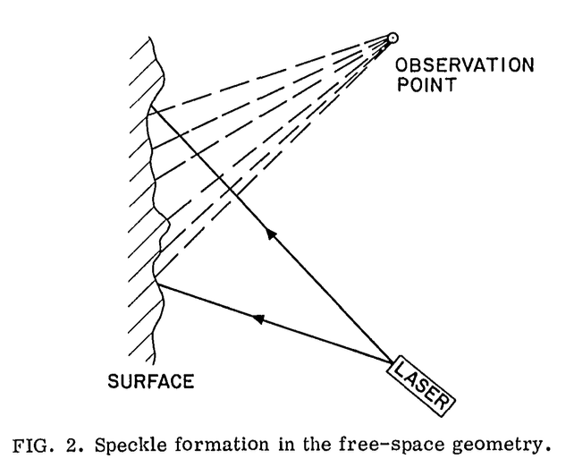

```{r setup}
library(ggplot2)
library(ggthemes)
  theme_set(theme_tufte() +
  theme(text=element_text(size=20, family="serif")))
library(caret)
library(patchwork)
library(scales)

set.seed(123456789, kind="Mersenne-Twister")
```

# Introduction

## Measurement

::: columns
::: {.column width="40%"}

<span style="font-size:50%;">From @SomeFundamentalPropertiesofSpeckle.</span>
:::
:::{.column width="60%"}
Speckle is an interference phenomenon common to all coherent imaging systems (laser, ultrasound-B, sonar, SAR -- Synthetic Aperture Radar).

We often assume that the total return is the sum of infinitely many elementary returns.
:::
:::


## What is "texture" in a SAR image? {.fullsmall .orange-slide}

"Texture" is any departure from the fully-developed speckle hypothesis.

The observation in a pixel is
$$
S = \sum_{\ell=1}^m S_\ell e^{j \phi_\ell}.
$$
If

* $m\to\infty$ (infinitely many scatterers in the resolution cell),
* $\max\operatorname{Var}(S_\ell)<\infty$ (no scatterer dominates),
* $|S_\ell| \perp |S_k|$ (independent amplitudes),
* $\phi_\ell\sim\mathcal U(-\pi,\pi]$ (uninformative phases),
* $\phi_\ell \perp \phi_k$ (independent phases),
* the amplitudes are collectively independent of the phases,

then$\dots$

## What is "fully-developed speckle"? {.fullsmall .orange-slide}

$\dots$ we can invoke the Central Limit Theorem:
$$
S = \sum_{\ell=1}^m S_\ell e^{j \phi_\ell} =
\underbrace{\sum_{\ell=1}^m |S_\ell| \cos \phi_\ell}_{\Re(S)} +
j \underbrace{\sum_{\ell=1}^m |S_\ell| \sin \phi_\ell}_{\Im(S)},
$$
and say that $\Re(S)$ and $\Im(S)$ are asymptotically normal distributed and independent.

With that,
$$
|S|^2\sim\text{E}(\mu),
$$
where $\mu$ is the backscatter, assumed [constant]{.alert} among pixels of the same type.

Equivalently,
$$
|S|^2\sim\mu\text{E}(1),
$$
the basis for the multiplicative model [@SARImageStatisticalModelingPartISinglePixelStatisticalModels].

## Do we observe fully-developed speckle in practice?

::: columns

::: {.column width="60%"}

::: {.incremental}
* The number of backscatterers $m$ is the number of elements in the resolution cell ($\propto 1\text{ m}\times1\text{ m}$) of the order of the wavelength
   * X-band: $\approx 3\text{ cm}$
   * L-band: $\approx 20\text{ cm}$
* Pasture, crops, and bare soil usually verify $m\to\infty$ and the other hypotheses.
:::

:::

::: {.column width="40%"}

```{r}
#| echo: false
#| fig-align: center
#| fig-width: 10
#| fig-height: 10
#| out-width: "100%"

knitr::include_graphics("../Figures/foggia-italy_1900.png")
```

:::
:::

## Do we observe fully-developed speckle in practice?

We took a sample of $15561$ observations over crops.

::: columns
::: column
{out-width="90%"}
:::
::: column
{out-width="90%"}
:::
:::

## Multilook imaging

:::{.incremental}
* Exponentially distributed observations are very noisy.
* We average $L$ (ideally independent) pixels, and obtain a multilook image with (ideally) $L$ looks.
* Under the assumptions of fully-developed speckle,
$$
Z=|S|^2 \sim \Gamma_{\text{SAR}}(\mu, L),
$$
a Gamma distribution conveniently parametrised by the mean $\mu>0$ and
the shape $L\geq 1$:
$$
\color{DarkOrchid}{f_{\Gamma_{\mathrm{SAR}}}\bigl(z;\mu, L\bigr) 
    = \frac{L^L}{\Gamma(L)\,\mu^L} z^{L-1} 
    \exp \biggl(-\frac{Lz}{\mu}\biggr)
    \mathbb I_{\mathbb R_+}(z)}. 
$$
:::

## What happens if the speckle is not fully-developed? {.fullsmall}

::: columns

::: column

```{r}
#| echo: false
#| fig-align: center
#| fig-width: 10
#| fig-height: 10
#| out-width: "100%"

knitr::include_graphics("../Figures/dubli_1600.png")
```

:::

::: column

:::{.incremental}

* This may occur when at least one of the hypotheses is violated.
* Typically, when $m$ is finite, i.e., the number of elementary backscatterers in the resolution cell is not big:
   * a few in forested regions,
   * even less in urban areas.
* When the backscatter changes among resolution cells.
* [The $\Gamma_{\text{SAR}}$ model fails to describe the extreme variability.]{.alert}

:::

:::

:::

## Non fully-developed speckle

The $\mathcal G^0_{\text{SAR}}$ model generalises the $\Gamma_{\text{SAR}}$ 
distribution and incorporates $\alpha<0$, such that $|\alpha|\propto m$, the number of backscatterers:
\begin{multline}    
\color{DarkOrchid}{f_{\mathcal{G}^0_{\text{SAR}}}\bigl(z; \mu, \alpha, L \bigr)} 
    = \\ \color{DarkOrchid}{\frac{L^L\,\Gamma(L-\alpha)}
    {\bigl[-\mu(\alpha+1)\bigr]^{\alpha} \Gamma(-\alpha)\,\Gamma(L)}
    \frac{z^{L-1}}
    {\bigl[-\mu(\alpha+1)+Lz\bigr]^{L-\alpha}}
    \mathbb I_{\mathbb R_+}(z)},
\end{multline}
where $\mu > 0$ is the mean intensity.

This model can describe data with extreme variability ($\alpha\approx0$) and fully-developed speckle ($\alpha\to-\infty$).

## Recap {.orange-slide}

We have two models to describe the observations:

* The $\Gamma_{\text{SAR}}(\mu,L)$ model for fully-developed speckle, and
* The more general $\mathcal G^0_{\text{SAR}}(\mu,\alpha,L)$ law that includes the fully-developed speckle situation.

[We want to measure how close (or far) we are from the fully-developed speckle model, but using small samples possibly contaminated by outliers.]{.alert}

# Methodology

## Goodness-of-fit tests 

Given a random sample $\mathbf Z = (Z_1,Z_2,\dots,Z_n)$, our problem can be stated as a goodness-of-fit test:
<!-- \begin{align} -->
<!-- \mathcal H_0 &: \mathbf Z \text{ is compatible with } \Gamma_{\text{SAR}}(\mu,L),\\ -->
<!-- \mathcal H_1 &:  \mathbf Z \text{ is not compatible with } \mathcal \Gamma_{\text{SAR}}(\mu,L). -->
<!-- \end{align} -->

<!-- We make it more specific: -->
\begin{align}
\mathcal H_0 &: \mathbf Z \text{ is compatible with } \Gamma_{\text{SAR}}(\mu,L),\\
\mathcal H_1 &:  \mathbf Z \text{ is compatible with } \mathcal G^0_{\text{SAR}}(\mu,\alpha,L).
\end{align}

It is a nested-distribution problem.
There are plenty of tests for problems like this.
We propose one that:

::: {.incremental}
* Performs well with relatively small samples.
* Is resistant to departures from the hypothesised models.
* Is computationally efficient.
:::

## What do we use?

```{r}
#| echo: false
#| fig-align: center
#| fig-width: 10
#| fig-height: 10
#| out-width: "100%"

knitr::include_graphics("../Figures/entropy.jpg")
```


## Flavours of Entropy

The notion of "entropy" encompasses several measures of unpredictability.

For a continuous random variable characterised by a probability density function $f$, we have (among infinitely many others):

* Shannon entropy [@Frery2024]: $\int ( - \ln f) f$.
* Rényi entropy [@Alpala2025] of order $\lambda\in\mathbb R_+\setminus\{1\}$: $\frac{1}{\lambda-1} \ln \int f^\lambda$.
* Tsallis entropy of order $\lambda\in\mathbb R_+\setminus\{1\}$: 
$$
\color{DarkOrchid}{\frac{1}{\lambda-1}\bigg(1-\int f^\lambda\bigg)}.
$$

## Tsallis entropy: $\Gamma_{\mathrm{SAR}}$ and $\mathcal{G}^0_{\text{SAR}}$ distributions {.fullsmall}

\begin{multline}
\label{eq:gammasar-Tsallis}
T_\lambda\bigl(\Gamma_{\mathrm{SAR}}(\mu, L)\bigr)=
\frac{1}{\lambda-1}\Bigl\{1-
\exp\bigl[
(1-\lambda)\ln\mu
+(\lambda-1)\ln L
+\ln\Gamma\bigl(\lambda(L-1)+1\bigr) \\
-\lambda\ln\Gamma(L)
-(\lambda(L-1)+1)\ln\lambda
\bigr]\Bigr\}, 
\end{multline}
and
\begin{multline}
\label{eq:GI0-Tsallis}
  T_\lambda\bigl(\mathcal{G}^0_{\text{SAR}}(\mu,\alpha,L)\bigr) = T_\lambda\bigl(\Gamma_{\mathrm{SAR}}(\mu, L)\bigr) + 
  \frac{1}{\lambda-1}\,
  \exp\Bigl[
  (1-\lambda)\ln\mu
  +(\lambda-1)\ln L\\
  +\ln\Gamma\bigl(\lambda(L-1)+1\bigr)
  -\lambda\ln\Gamma(L)
  \Bigr] 
  \Bigl\{1-
  \exp\bigl[
  (1-\lambda)\ln(-\alpha-1)
  +\lambda\ln\Gamma(L-\alpha)\\
  -\lambda\ln\Gamma(-\alpha) 
  +\ln\Gamma\bigl(\lambda(1-\alpha)-1\bigr)
  -\ln\Gamma\bigl(\lambda(L-\alpha)\bigr)
  \bigr]\Bigr\}.
\end{multline}

This means that
\begin{equation*}
  \color{DarkOrchid}{T_\lambda\bigl(\mathcal{G}^0_{\text{SAR}}(\mu,\alpha,L)\bigr)
  =
  \underbrace{T_\lambda \bigl(\Gamma_{\mathrm{SAR}}(\mu,L)\bigr)}_{\text{baseline entropy}} 
  \hspace{1.8em} + \hspace{-1.8em}
  \underbrace{\Delta(\mu, L, \alpha)}_{\text{entropy excess caused by texture}}.\hspace{-4.0em}}
\end{equation*}
where the term $\Delta_\alpha$ measures the increase in entropy induced by the texture level, with the level controlled by the parameter $\alpha$.

##

The relationship 
\begin{equation*}
  \color{DarkOrchid}{T_\lambda\bigl(\mathcal{G}^0_{\text{SAR}}(\mu,\alpha,L)\bigr)
  =
T_\lambda \bigl(\Gamma_{\mathrm{SAR}}(\mu,L)\bigr) +
  \Delta(\mu, L, \alpha)}
\end{equation*}
gives a hint to build a test statistic:

::: {.incremental}
* Estimate the Tsallis entropy with the random sample $\mathbf Z=(Z_1,Z_2,\dots,Z_n)$.
* Check if it is close to the theoretical Tsallis entropy under the $\Gamma_{\mathrm{SAR}}$ model or to the Tsallis entropy under the $\mathcal{G}^0_{\text{SAR}}(\mu,L)$.
:::

## But$\dots$ how?

In the following, assume we know $L$, e.g., as the nominal number of looks.

We need
$$
\widehat{T_\lambda} \bigl(\Gamma_{\mathrm{SAR}}(\mu)\bigr) \text { or }
\widehat{T_\lambda} \bigl(\mathcal G^0_{\mathrm{SAR}}(\mu,\alpha)\bigr),
$$
but we don't trust $\widehat\mu$ and don't want to compute $\widehat\alpha$.

##

We make a clever transformation:
\begin{multline}  
T_\lambda
  =
\frac{1}{1-\lambda}\biggl(1-
\int_{-\infty}^{\infty} f^\lambda(x) dx \biggr) =  \\
  \frac{1}{\lambda-1}
     \left(
       1-\int_{0}^{1}\bigl(Q'(p)\bigr)^{1-\lambda}\,\mathrm{d}p
     \right),
\end{multline}
which allows us to

* approximate the quantile function $Q(p)$ by order statistics, 
* and its derivative $Q'(p)$ by their differences (spacings).
* Approximate the integral by a sum.
- [Our main result is ready!]{.alert}

## {.fullsmall}

Let $\mathbf{Z}=(Z_1,Z_2,\dots,Z_n)$ be an i.i.d.\ sample from $F$, with order statistics $Z_{(1)}\le Z_{(2)} \le \cdots\le Z_{(n)}$.
Our estimator becomes
\begin{align}
  \widehat T_{\lambda}(\mathbf{Z})
  &=\frac{1}{\lambda-1}\left\{
1-\frac{1}{n}\sum_{i=1}^{n}\bigl[\widehat{Q'}(p_i)\bigr]^{1-\lambda}
\right\} \nonumber\\[4pt]
  &= \frac{1}{\lambda-1}
  \left\{
    1-\frac{1}{n}
       \sum_{i=1}^{n}
       \left(
         \frac{Z_{(i+k)}-Z_{(i-k)}}{(k/n) \, c_i}
       \right)^{1-\lambda}
  \right\},
  \label{eq:Tsallis-spacing-estimator}
\end{align}
where
$$
c_i=
\begin{cases}
\dfrac{k+i-1}{k} & \text{if } \; 1\le i\le k,\\
2 & \text{if } \; k+1\le i\le n-k,\\
\dfrac{n+k-i}{k} & \text{if } \; n-k+1\le i\le n.
\end{cases}
$$
We use the heuristic spacing $k=\lfloor\sqrt{n}+0.5\rfloor$.

## Noteworthy facts

Our [model-free]{.alert} estimator of $T_\lambda=\frac{1}{\lambda-1}
     \left(
       1-\int_{0}^{1}\bigl(Q'(p)\bigr)^{1-\lambda}\,\mathrm{d}p
     \right)$
$$
\color{DarkOrchid}{\widehat T_{\lambda}(\mathbf{Z})
  = \frac{1}{\lambda-1}
  \left\{
    1-\frac{1}{n}
       \sum_{i=1}^{n}
       \left(
         \frac{Z_{(i+k)}-Z_{(i-k)}}{(k/n) \, c_i}
       \right)^{1-\lambda}
  \right\}},
$$

::: {.incremental}
* estimates the Tsallis entropy regardless the model,
* converges to the Shannon entropy when $\lambda\rightarrow1$,
* requires sorting the typically small vector $\mathbf Z$ and simple operations,
* does not suffer from numerical instabilities.

:::

## We want [more]{.alert} I

We improve $\widehat T_{\lambda}(\mathbf{Z})$ by simple bootstrap [@davisonhinkleybootstrap97], and use 
$$
\widetilde T_{\lambda}(\mathbf{Z}) = 2\widehat T_{\lambda}(\mathbf{Z}) - \frac1B \sum_{b=1}^B \widehat T_{\lambda}(\mathbf{Z^{(b)}})
$$ 
that is less biased than $\widehat T_{\lambda}(\mathbf{Z})$.

## We want [more]{.alert} II

We optimise $\lambda$ with simulated data to achieve maximum discrimination between the models, and obtain 
$$
\lambda_{\text{optimal}} = 0.85.
$$

## We want [more]{.alert} III

We used adaptive windows, i.e., the sample size varies according to a rough initial estimate of homogeneity based on the coefficient of variation [@Park1999].

# Results

## San Francisco

```{r}
#| echo: false
#| results: asis

cat('
<div style="display: flex; justify-content: center; gap: 1em;">
  
  
</div>
')
```

## Munich

```{r}
#| echo: false
#| results: asis

cat('
<div style="display: flex; justify-content: center; gap: 1em;">
  
  
</div>
')
```

## Dublin port

```{r}
#| echo: false
#| results: asis

cat('
<div style="display: flex; justify-content: center; gap: 1em;">
  
  
</div>
')
```

## Foggia

```{r}
#| echo: false
#| results: asis

cat('
<div style="display: flex; justify-content: center; gap: 1em;">
  
  
</div>
')
```

# Discussion

## Conclusions {.orange-slide}

::: {.incremental}
* We [detect and quantify]{.alert} deviations from fully-developed speckle in intensity SAR images estimating the Tsallis entropy. 

* We [improve]{.alert} the test with bootstrap correction and adaptive windows.

* We do not need [training data or parametric modeling]{.alert}.

* The method is [robust]{.alert} for small samples, and [effective]{.alert} in delineating heterogeneous regions from homogeneous ones. 

* The results are [interpretable]{.alert}.

* [In the same way, you can make your distribution-free test for the problem you are studying]{.alert}
:::

## Our tool

We used the [sexiest]{.alert} organ of the human body:

{width=60%}

## Contact

::: columns
::: {.column width="25%"}
{out-width="40%"}

:::

::: {.column width="63%"}
  Alejandro C. Frery\
School of Mathematics and Statistics\
Victoria University of Wellington\
New Zealand\
  \
alejandro.frery at vuw.ac.nz\
 \
[Feel free to contact me!]{.alert}
::: 
:::

## References  {.references-slide}

