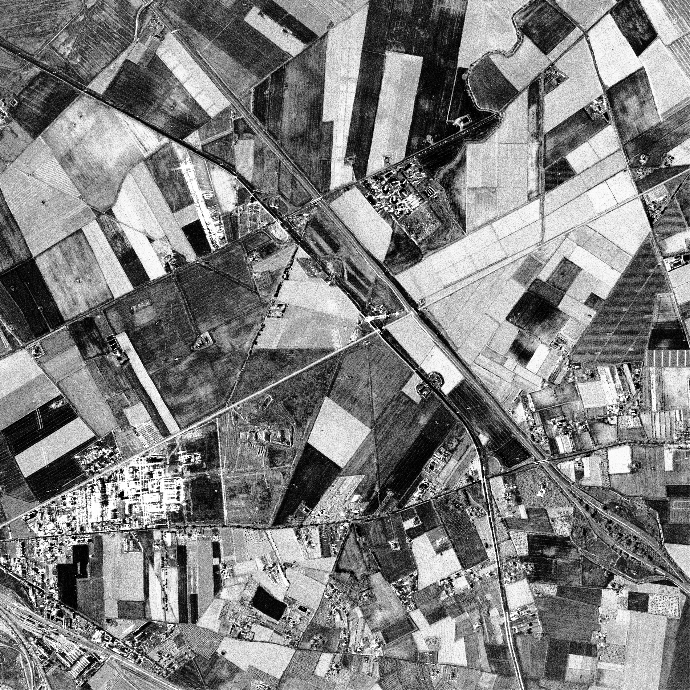
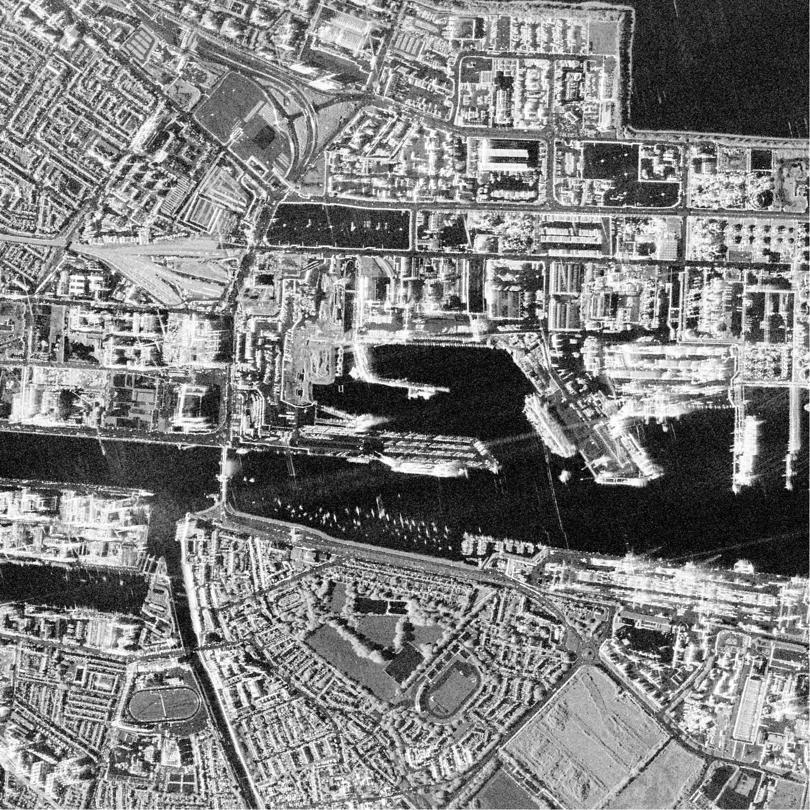
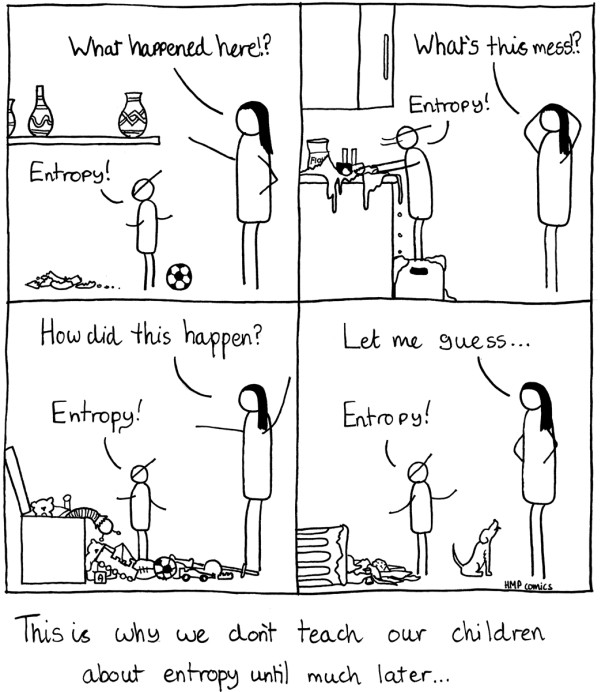
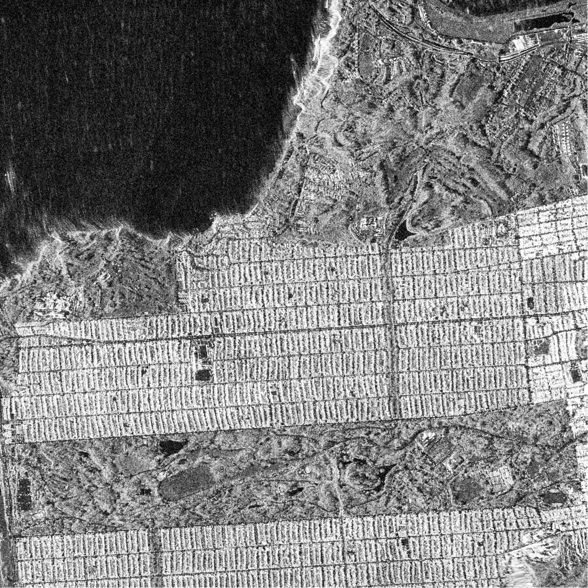
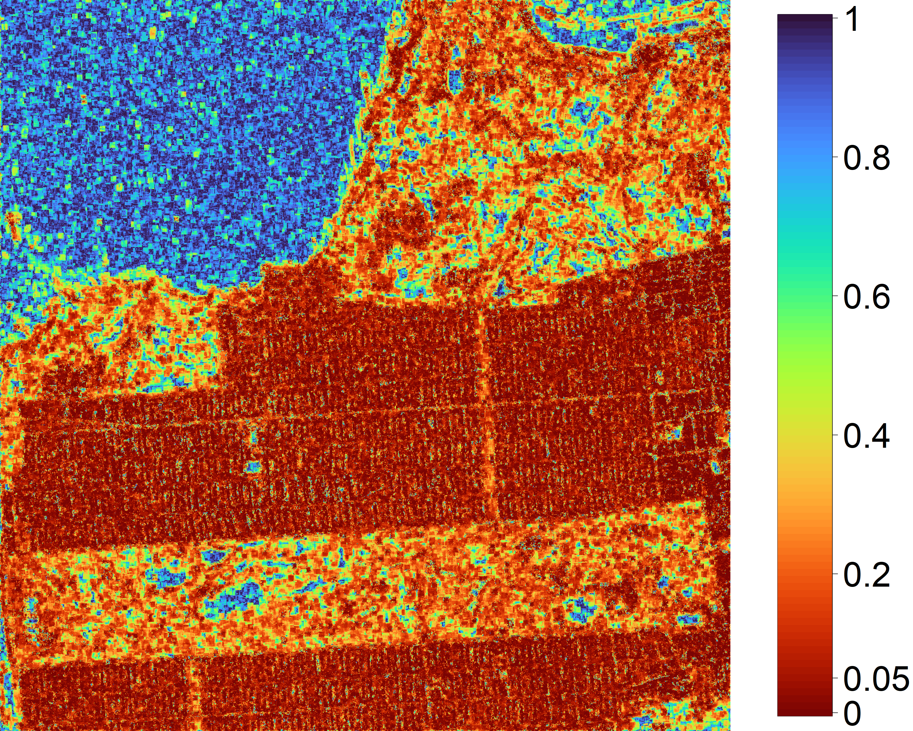
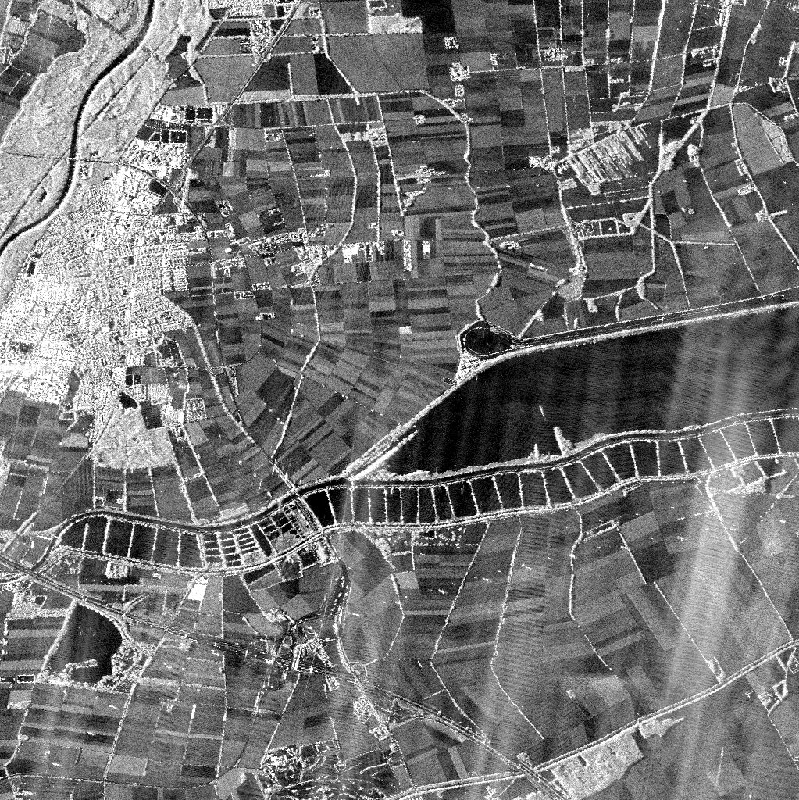
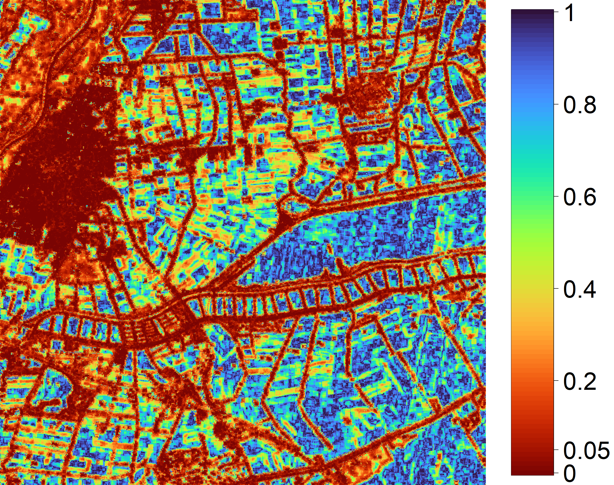
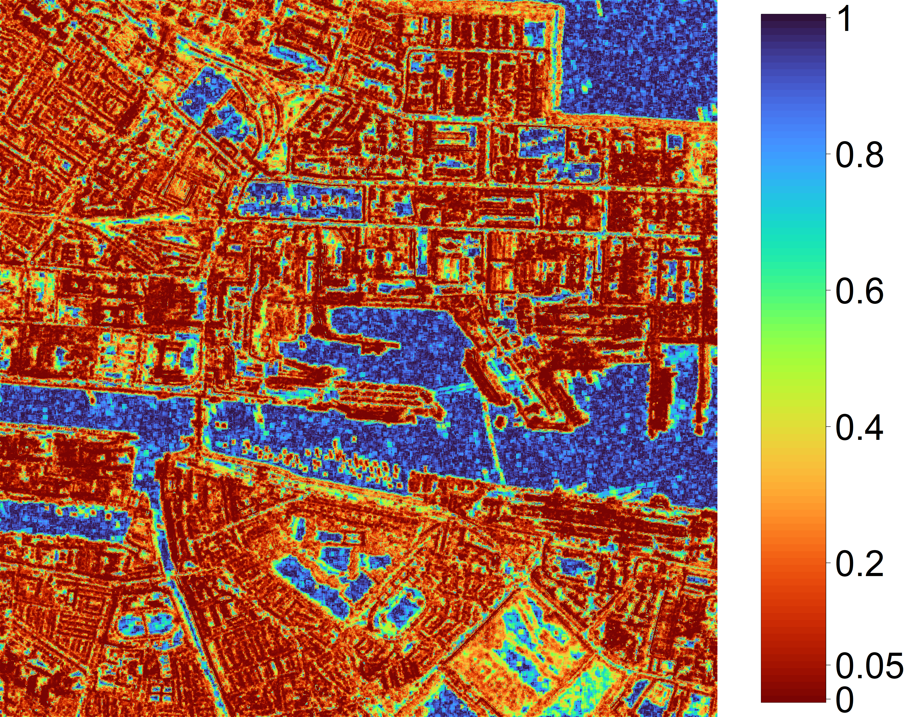
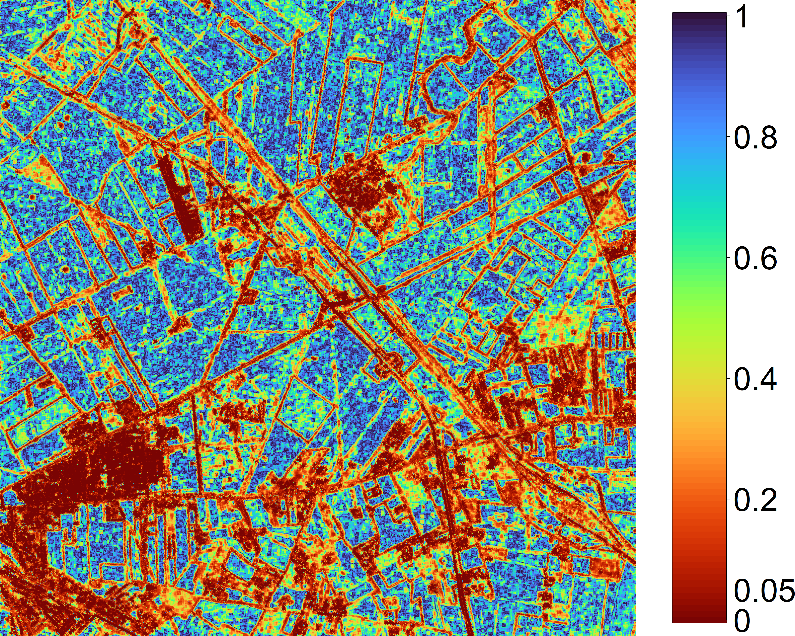

```{r setup}
library(ggplot2)
library(ggthemes)
  theme_set(theme_tufte() +
  theme(text=element_text(size=20, family="serif")))
library(caret)
library(patchwork)
library(scales)

set.seed(123456789, kind="Mersenne-Twister")
```

# Introduction

## What is "heterogeneity"?

::: {.incremental}
* There is no consensus.
* Some use the word to refer to a mixed sample.
* Others, to situations where the speckle is not fully-developed.
* We adopt the latter definition.
:::

## What is "speckle"? 

::: {.incremental}
* Speckle is an interference phenomenon common to every image produced by coherent imaging.
* Imagine the pixel value is formed by the addition of the return from $m$ elementary backscatterers:
$$
S = \sum_{\ell=1}^m S_\ell e^{j \phi_\ell},
$$
where $S$ is the complex observation,
$S_\ell$ is the amplitude returned by the $\ell$-th elementary backscatter,
$\phi_\ell$ is the phase of the signal returned by the $\ell$-th elementary backscatter,
and $m$ is the number of backscatterers.
:::

## 

The complex observation $S$ is the summation of complex quantities.

```{r ComplexReturn}
N <- 15 # number of scatterers
sigma2 <- 1
RAi <- c(rnorm(n = N, mean = 0, sd = sqrt(sigma2)))
IAi <- c(rnorm(n = N, mean = 0, sd = sqrt(sigma2)))

DATA <- data.frame(RAi, IAi)

ggplot(data=DATA) +
  geom_segment(aes(x=c(0, cumsum(RAi)[1:(N-1)]), # All vectors
                   y=c(0, cumsum(IAi)[1:(N-1)]), 
                   xend=cumsum(RAi), yend=cumsum(IAi)), 
               arrow=arrow(ends="last", 
                           type = "closed", 
                           angle = 15, 
                           length = unit(.3, units="cm")), 
               linewidth=.3, color="black") +
  geom_segment(aes(x=0, y=0, xend=sum(RAi), yend=sum(IAi)), # Sum of the vectors
               arrow=arrow(ends="last", 
                           type = "closed", 
                           angle = 15, 
                           length = unit(.4, units="cm")), 
               linewidth=1.2,
               col="maroon") +
  geom_segment(aes(x=RAi[1], xend=RAi[1], y=0, yend=IAi[1]), linewidth=.2, linetype="dashed") +
  geom_segment(aes(x=0, xend=RAi[1], y=IAi[1], yend=IAi[1]), linewidth=.2, linetype="dashed") +
  annotate("text", label="Re(italic(S)[1])", parse=TRUE, x=RAi[1], y=0, vjust=0, size=5, family="serif") +
  annotate("text", label="Im(italic(S)[1])", parse=TRUE, x=0, y=IAi[1], hjust=1, size=5, family="serif") +
  annotate("text", label="italic(S)[1]", parse=TRUE, x=RAi[1], y=IAi[1], hjust=0, size=5, family="serif") +
  annotate("text", label="italic(S)", parse=TRUE, x=sum(RAi)-.05, y=sum(IAi), hjust=1, size=7, family="serif") +
  geom_hline(yintercept=0, col="grey32") +
  geom_vline(xintercept=0, col="grey32") +
  coord_fixed() +
  xlab("Real components") + ylab("Imaginary components") 
```

##

Our hopes vs. reality.

::: {.incremental}
* If we had the distribution of $S$ for every conceivable target, enviromental condition, and sensor configuration, we'd be omniscient.
* We are far from that.
* We are satisfied with making broad assumptions.
* The most common assumption is the "fully-developed speckle".
:::

## What is "fully-developed speckle"? {.fullsmall .orange-slide}

Recall that the observation in a pixel is
$$
S = \sum_{\ell=1}^m S_\ell e^{j \phi_\ell}.
$$
If

* $m\to\infty$ (infinitely many scatterers in the resolution cell),
* $\max\operatorname{Var}(S_\ell)<\infty$ (no scatterer dominates),
* $|S_\ell| \perp |S_k|$ (independent amplitudes),
* $\phi_\ell\sim\mathcal U(-\pi,\pi]$ (uninformative phases),
* $\phi_\ell \perp \phi_k$ (independent phases),
* the amplitudes are collectively independent of the phases,

then$\dots$

## What is "fully-developed speckle"? {.fullsmall .orange-slide}

$\dots$ we can invoke the Central Limit Theorem:
$$
S = \sum_{\ell=1}^m S_\ell e^{j \phi_\ell} =
\underbrace{\sum_{\ell=1}^m |S_\ell| \cos \phi_\ell}_{\Re(S)} +
j \underbrace{\sum_{\ell=1}^m |S_\ell| \sin \phi_\ell}_{\Im(S)},
$$
and say that $\Re(S)$ and $\Im(S)$ are asymptotically normal distributed and independent.

With that,
$$
|S|^2\sim\text{E}(\mu),
$$
where $\mu$ is the backscatter, assumed [constant]{.alert} among pixels of the same type.

Equivalently,
$$
|S|^2\sim\mu\text{E}(1),
$$
the basis for the multiplicative model [@SARImageStatisticalModelingPartISinglePixelStatisticalModels].

## Do we observe fully-developed speckle in practice?

::: columns

::: column 

::: {.incremental}
* The number of backscatterers $m$ is the number of elements in the resolution cell of the order of the wavelength
   * X-band: $\approx 3\text{ cm}$
   * L-band: $\approx 20\text{ cm}$
* Pasture, crops, and bare soil usually verify $m\to\infty$ and the other hypotheses.
:::

:::

::: column 

```{r}
#| echo: false
#| fig-align: center
#| fig-width: 10
#| fig-height: 10
#| out-width: "100%"


```

:::

:::

## Multilook imaging

:::{.incremental}
* Exponentially distributed observations are very noisy.
* We average $L$ (ideally independent) pixels, and obtain a multilook image with (ideally) $L$ looks.
* Under the assumptions of fully-developed speckle,
$$
Z=|S|^2 \sim \Gamma_{\text{SAR}}(\mu, L),
$$
a Gamma distribution conveniently parametrised by the mean $\mu>0$ and
the shape $L\geq 1$.
* If $L=1$, we fall back to the exponential model.
:::

## Properties of the Gamma distribution

:::{.incremental}
* It is characterised by the probability density function
$$
	\color{DarkOrchid}{f_{\Gamma_{\mathrm{SAR}}}\bigl(z;\mu, L\bigr) 
    = \frac{L^L}{\Gamma(L)\,\mu^L} z^{L-1} 
    \exp \biggl(-\frac{Lz}{\mu}\biggr)
    \mathbb I_{\mathbb R_+}(z)}. 
$$
* Its variance and coefficient of variation are
$$
\operatorname{Var}(Z) = \frac{\mu^2}{L},\text{ and }
\operatorname{CV}(Z) = \frac{\sqrt{\operatorname{Var}(Z)}}{\mu} = \frac{1}{\sqrt{L}}.
$$
* The coefficient of variation is widely used to check if the observations are fully-developed speckle.
:::

## Properties of the Gamma distribution

Multiplicative property:
if 
\begin{align}
W &\sim\Gamma_{\text{SAR}}(1,L), \\
\text{then}\\
Z=\mu W&\sim\Gamma_{\text{SAR}}(\mu,L).
\end{align}

This property leads to more general models by letting $\mu$ be a random variable.

## What happens if the speckle is not fully-developed? {.fullsmall}

::: columns

::: column

```{r}
#| echo: false
#| fig-align: center
#| fig-width: 10
#| fig-height: 10
#| out-width: "100%"


```

:::

::: column

:::{.incremental}

* This may occur when at least one of the hypotheses is violated.
* Typically, when $m$ is finite, i.e., the number of elementary backscatterers in the resolution cell is not big:
   * a few in forested regions,
   * even less in urban areas.
* When the backscatter changes among resolution cells.

:::

:::

:::

## What happens if the speckle is not fully-developed? {.fullsmall}

Instead of assuming $\mu$ constant, we may assume that it is a random variable.

@Frery1997 proposed the inverse Gamma distribution for the backscatter, leading to the $\mathcal G^0_{\text{SAR}}$ model, characterised by the probability density function
$$    
\color{DarkOrchid}{f_{\mathcal{G}^0_{\text{SAR}}}\bigl(z; \mu, \alpha, L \bigr) 
    = \frac{L^L\,\Gamma(L-\alpha)}
    {\bigl[-\mu(\alpha+1)\bigr]^{\alpha} \Gamma(-\alpha)\,\Gamma(L)}
    \frac{z^{L-1}}
    {\bigl[-\mu(\alpha+1)+Lz\bigr]^{L-\alpha}}
    \mathbb I_{\mathbb R_+}(z)}. 
$$
Here, $\mu > 0$ is the mean intensity, 
$\alpha < 0$ is the texture (heterogeneity) parameter, which relates with the number of backscatterers $m$,
and $L \geq 1$ is the number of looks.

The $\mathcal G^0_{\text{SAR}}$ model can describe data with extreme variability ($\alpha\approx0$) as well as fully-developed speckle ($\alpha\to-\infty$).

## Recap {.orange-slide}

We have two models to describe the observations:

* The $\Gamma_{\text{SAR}}(\mu,L)$ model for fully-developed speckle, and
* The more general $\mathcal G^0_{\text{SAR}}(\mu,\alpha,L)$ law that includes the fully-developed speckle situation.

[We want to identify where we are, but using small samples possibly contaminated by outliers.]{.alert}

# Methodology

## Goodness-of-fit tests

Given a random sample $\mathbf Z = (Z_1,Z_2,\dots,Z_n)$, our problem can be stated as a goodness-of-fit test:
\begin{align}
\mathcal H_0 &: \mathbf Z \text{ is compatible with } \Gamma_{\text{SAR}}(\mu,L),\\
\mathcal H_1 &:  \mathbf Z \text{ is compatible with } \mathcal G^0_{\text{SAR}}(\mu,\alpha,L).
\end{align}

It is a nested-distribution problem.
There are plenty of tests for problems like this, but we want one that

::: {.incremental}
* Performs well with relatively small samples.
* Is resistant to departures from the hypothesised models.
* Is computationally efficient.
:::

## Goodness-of-fit tests

Nested-distribution goodness-of-fit tests can be sorted out with, among others, the following approaches [@MathematicalStatisticsvII2015; @ModelSelectionandMultimodelInference; @davisonhinkleybootstrap97]:

* Likelihood-ratio tests
* Score tests
* Wald tests
* Information criterion comparison tests
* Bootstrap

They are very sensitive to outliers.

## Goodness-of-fit tests

[We opt for an information-theory based approach based on entropy.]{.alert}

Our proposal has the good properties of semiparametric statistics:

::: {.incremental}
* It uses a parametric property of the $\Gamma_{\text{SAR}}$ model.
* It does not estimate the roughness parameter of the $\mathcal G^0_{\text{SAR}}$ models (which may be numerically unstable).
* It performs well with small samples.
* It resists contamination.
* It is interpretable.
:::

## What do we use?

```{r}
#| echo: false
#| fig-align: center
#| fig-width: 10
#| fig-height: 10
#| out-width: "100%"


```

## Why do we use the entropy?

According to @EnergyandInformation, Claude Shannon used the word [entropy]{.alert} for the quantity he had defined because

> "My greatest concern was what to call it. I
thought of calling it 'information,' but
the word was overly used, so I decided
to call it 'uncertainty.' When I discussed
it with John von Neumann, he had a better
idea. Von Neumann told me, 'You
should call it entropy, for two reasons.
In the first place your uncertainty function
has been used in statistical mechanics
under that name, so it already has a
name. In the second place, and more
important, no one knows what entropy
really is, so in a debate you will always
have the advantage.' "

## Flavours of Entropy

The notion of "entropy" encompasses several measures of unpredictability.

For a continuous random variable characterised by a probability density function $f$, we have (among infinitely many others):

:::{.incremental}
* Shannon entropy: $\int ( - \ln f) f$.
* Rényi entropy of order $\lambda\in\mathbb R_+\setminus\{1\}$: $\frac{1}{\lambda-1} \ln \int f^\lambda$.
* Tsallis entropy of order $\lambda\in\mathbb R_+\setminus\{1\}$: 
$$
\color{DarkOrchid}{\frac{1}{\lambda-1}\bigg(1-\int f^\lambda\bigg)}.
$$
:::

## Tsallis entropy {.fullsmall}

Under the $\Gamma_{\mathrm{SAR}}$ and the $\mathcal{G}^0_{\text{SAR}}$ distributions:

\begin{multline}
\label{eq:gammasar-Tsallis}
T_\lambda\bigl(\Gamma_{\mathrm{SAR}}(\mu, L)\bigr)=
\frac{1}{\lambda-1}\Bigl\{1-
\exp\bigl[
(1-\lambda)\ln\mu
+(\lambda-1)\ln L
+\ln\Gamma\bigl(\lambda(L-1)+1\bigr) \\
-\lambda\ln\Gamma(L)
-(\lambda(L-1)+1)\ln\lambda
\bigr]\Bigr\}, 
\end{multline}
and
\begin{multline}
\label{eq:GI0-Tsallis}
  T_\lambda\bigl(\mathcal{G}^0_{\text{SAR}}(\mu,\alpha,L)\bigr) = T_\lambda\bigl(\Gamma_{\mathrm{SAR}}(\mu, L)\bigr) + 
  \frac{1}{\lambda-1}\,
  \exp\Bigl[
  (1-\lambda)\ln\mu
  +(\lambda-1)\ln L\\
  +\ln\Gamma\bigl(\lambda(L-1)+1\bigr)
  -\lambda\ln\Gamma(L)
  \Bigr] 
  \Bigl\{1-
  \exp\bigl[
  (1-\lambda)\ln(-\alpha-1)
  +\lambda\ln\Gamma(L-\alpha)\\
  -\lambda\ln\Gamma(-\alpha) 
  +\ln\Gamma\bigl(\lambda(1-\alpha)-1\bigr)
  -\ln\Gamma\bigl(\lambda(L-\alpha)\bigr)
  \bigr]\Bigr\}.
\end{multline}

This means that
\begin{equation*}
  \color{DarkOrchid}{T_\lambda\bigl(\mathcal{G}^0_{\text{SAR}}(\mu,\alpha,L)\bigr)
  =
  \underbrace{T_\lambda \bigl(\Gamma_{\mathrm{SAR}}(\mu,L)\bigr)}_{\text{baseline entropy}} 
  \hspace{1.8em} + \hspace{-1.8em}
  \underbrace{\Delta(\mu, L, \alpha)}_{\text{entropy excess caused by texture}}.\hspace{-4.0em}}
\end{equation*}
where the term $\Delta_\alpha$ measures the increase in entropy induced by the texture level, with the level controlled by the parameter $\alpha$.

##

The relationship 
\begin{equation*}
  \color{DarkOrchid}{T_\lambda\bigl(\mathcal{G}^0_{\text{SAR}}(\mu,\alpha,L)\bigr)
  =
T_\lambda \bigl(\Gamma_{\mathrm{SAR}}(\mu,L)\bigr) +
  \Delta(\mu, L, \alpha)}
\end{equation*}
gives a hint to build a test statistic:

::: {.incremental}
* Estimate the Tsallis entropy with the random sample $\mathbf Z=(Z_1,Z_2,\dots,Z_n)$.
* Check if it is close to the theoretical Tsallis entropy under the $\Gamma_{\mathrm{SAR}}$ model or to the Tsallis entropy under the $\Gamma_{\mathrm{SAR}}(\mu,L)$.
:::

## But$\dots$ how?

In the following, assume we know $L$, e.g., as the nominal number of looks.

We need
$$
\widehat{T_\lambda} \bigl(\Gamma_{\mathrm{SAR}}(\mu)\bigr) \text { or }
\widehat{T_\lambda} \bigl(\mathcal G^0_{\mathrm{SAR}}(\mu,\alpha)\bigr),
$$
but we don't trust $\widehat\mu$ and don't want to compute $\widehat\alpha$.

## Model-free estimation of the entropy

The technique consists of 

1. Writing the Tsallis entropy as a function of the quantile function.
1. Make sensible approximations

@vasicek1976test and @Ebrahimi1994 proposed spacing-based estimation for the Shannon entropy; we used it in @Frery2024.
@AlLabadi2024 followed the approach for the Rényi entropy; we used it in @Alpala2025.

We proceed in the same way, and obtain a non-parametric (model-free) estimator for the Tsallis entropy.

## {.fullsmall}

Denote $Q(p)=F^{-1}(p)$ the quantile function for $p\in(0,1)$. 
Then:
$$
\int_{\mathcal B} f(z)^\lambda\,\mathrm{d}z
=\int_{\mathcal B} f(z)^{\lambda-1} f(z)\,\mathrm{d}z
=\mathbb{E}\!\left[f(Z)^{\lambda-1}\right].
$$
Using the change of variables $p=F(z)$ (hence $\mathrm{d}p=f(z)\,\mathrm{d}z$) and the identity $f(Q(p))=1/Q'(p)$, we obtain
$$
  \mathbb{E}\!\left[f(Z)^{\lambda-1}\right]
  = \int_{0}^{1} \bigl(Q'(p)\bigr)^{1-\lambda}\,\mathrm{d}p,
$$
which yields the representation
\begin{equation}
  T_\lambda(Z)
  =\frac{1}{\lambda-1}
     \left\{
       1-\int_{0}^{1}\bigl(Q'(p)\bigr)^{1-\lambda}\,\mathrm{d}p
     \right\}.
  \label{eq:Tsallis-quantile}
\end{equation}

Be bold, and

::: {.incremental}
* Approximate $Q(p)$ by order statistics, and $Q'(p)$ by their differences (spacings),
* Approximate the integral by a sum.

::: 

## {.fullsmall}

Let $\mathbf{Z}=(Z_1,Z_2,\dots,Z_n)$ be an i.i.d.\ sample from $F$, with order statistics $Z_{(1)}\le Z_{(2)} \le \cdots\le Z_{(n)}$.
Our estimator becomes
\begin{align}
  \widehat T_{\lambda}(\mathbf{Z})
  &=\frac{1}{\lambda-1}\left\{
1-\frac{1}{n}\sum_{i=1}^{n}\bigl[\widehat{Q'}(p_i)\bigr]^{\,1-\lambda}
\right\} \nonumber\\[4pt]
  &= \frac{1}{\lambda-1}
  \left\{
    1-\frac{1}{n}
       \sum_{i=1}^{n}
       \left(
         \frac{Z_{(i+k)}-Z_{(i-k)}}{(k/n) \, c_i}
       \right)^{1-\lambda}
  \right\},
  \label{eq:Tsallis-spacing-estimator}
\end{align}
where
$$
c_i=
\begin{cases}
\dfrac{k+i-1}{k} & \text{if } \; 1\le i\le k,\\
2 & \text{if } \; k+1\le i\le n-k,\\
\dfrac{n+k-i}{k} & \text{if } \; n-k+1\le i\le n.
\end{cases}
$$
We use the heuristic spacing $k=\lfloor\sqrt{n}+0.5\rfloor$.

## Noteworthy facts

Our estimator
$$
\color{DarkOrchid}{\widehat T_{\lambda}(\mathbf{Z})
  = \frac{1}{\lambda-1}
  \left\{
    1-\frac{1}{n}
       \sum_{i=1}^{n}
       \left(
         \frac{Z_{(i+k)}-Z_{(i-k)}}{(k/n) \, c_i}
       \right)^{1-\lambda}
  \right\}},
$$

::: {.incremental}
* estimates the Tsallis entropy regardless the model,
* converges to the Shannon entropy when $\lambda\rightarrow1$,
* requires sorting the typically small vector $\mathbf Z$ and simple operations,
* does not suffer from numerical instabilities.

:::

## We want [more]{.alert} I

We improve $\widehat T_{\lambda}(\mathbf{Z})$ by simple bootstrap, and use $\widetilde T_{\lambda}(\mathbf{Z})$ that is less biased than $\widehat T_{\lambda}(\mathbf{Z})$.

## We want [more]{.alert} II

We optimise $\lambda$ with simulated data to achieve maximum discrimination between the models, and obtain 
$$
\lambda_{\text{optimal}} = 0.85.
$$

## We want [more]{.alert} III

We used adaptive windows, i.e., the sample size varies according to a rough initial estimate of homogeneity based on the coefficient of variation [@Park1999].

# Results

## San Francisco

```{r}
#| echo: false
#| results: asis

cat('
<div style="display: flex; justify-content: center; gap: 1em;">
  
  
</div>
')
```

## Munich

```{r}
#| echo: false
#| results: asis

cat('
<div style="display: flex; justify-content: center; gap: 1em;">
  
  
</div>
')
```

## Dublin port

```{r}
#| echo: false
#| results: asis

cat('
<div style="display: flex; justify-content: center; gap: 1em;">
  
  
</div>
')
```

## Foggia

```{r}
#| echo: false
#| results: asis

cat('
<div style="display: flex; justify-content: center; gap: 1em;">
  
  
</div>
')
```

# Discussion

## Conclusions {.fullsmall .orange-slide}

This work presented a statistical approach based on Tsallis entropy to detect deviations from fully-developed speckle in intensity SAR images. 
The proposed  test integrates a bootstrap correction and an adaptive windowing scheme to balance speckle suppression and texture preservation without requiring training data or parametric modeling.

Experiments with simulated and real SAR data demonstrated that the method is well-calibrated, robust for small samples, and effective in delineating heterogeneous regions from homogeneous ones. 
A Monte Carlo validation confirmed that the test maintains proper control of the Type&nbsp;I error while improving detection power with increasing sample size.

Although machine learning-based SAR classifiers are widely used, this framework offers a statistically grounded alternative that provides interpretable significance measures and requires no labelled data, making it suitable for rapid detection, screening, and scenarios with limited data availability.

## Contact

::: columns
::: {.column width="35%"}

:::

::: {.column width="63%"}
<ul style="list-style-type: none; padding-left: 0;">
  <li>Alejandro C. Frery</li>
  <li>School of Mathematics and Statistics</li>
  <li>Victoria University of Wellington</li>
  <li>New Zealand</li>
  <li></li>
  <li>alejandro.frery at vuw.ac.nz</li>
</ul>
::: 
:::

## References  {.references-slide}

